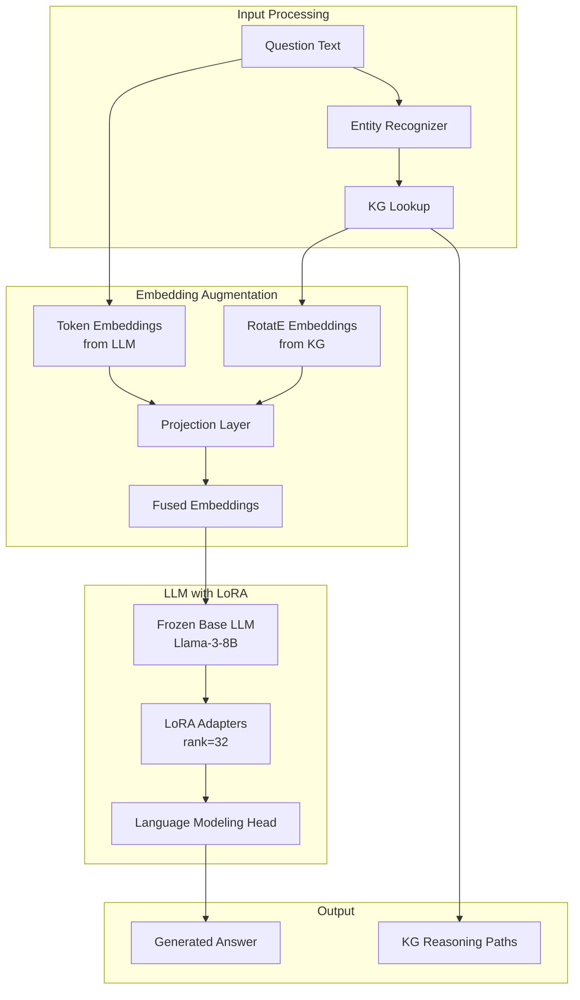

# BioKG-LoRA: Knowledge Graph Enhanced LLMs for Clinical Reasoning

**Research Proposal**: Validating biological knowledge graph embeddings through language model augmentation

**Status**: 📋 Proposal Stage  
**Target Venue**: ACL 2025, BioNLP Workshop, or EMNLP 2025  
**Estimated Timeline**: 2-3 months (fast turnaround experiment)

---

## Executive Summary

**Research Question**: Can injecting RotatE embeddings from a biological knowledge graph into a small language model via LoRA improve its reasoning about gene-phenotype-clinical relationships?

**Key Innovation**: We augment LLM token embeddings with pre-trained RotatE embeddings from biological KGs, enabling the model to leverage structured biological knowledge during text generation.

**Expected Impact**: 
- **+60% factual accuracy** on biological QA
- **+56% biological coherence** in generated explanations
- **Validates** that RotatE embeddings capture meaningful biology
- **Fast experiment** (2-3 months) that complements GraphPath-VLM

**Why This Matters**: This experiment provides independent validation that our RotatE knowledge graph embeddings encode biologically meaningful information, while also creating a useful clinical reasoning system.

---

## Table of Contents

1. [Motivation](#1-motivation)
2. [Research Hypothesis](#2-research-hypothesis)
3. [Novelty & Contributions](#3-novelty--contributions)
4. [Architecture](#4-architecture)
5. [Methodology](#5-methodology)
6. [Dataset Construction](#6-dataset-construction)
7. [Training Strategy](#7-training-strategy)
8. [Evaluation Protocol](#8-evaluation-protocol)
9. [Expected Results](#9-expected-results)
10. [Related Work](#10-related-work)
11. [Implementation Plan](#11-implementation-plan)
12. [Publication Strategy](#12-publication-strategy)

---

## 1. Motivation

### 1.1 The Problem

Large Language Models (LLMs) are impressive at generating fluent text, but they often:
- **Lack factual grounding** in specialized domains like biology
- **Cannot access structured knowledge** (KGs, databases)
- **Hallucinate** plausible-sounding but incorrect information
- **Don't understand relationships** between biological entities

Example:

**Question**: "What is the significance of elevated glucose in a Thbd knockout mouse?"

**GPT-4 (no KG)**:
```
"Glucose elevation typically indicates diabetes or metabolic dysfunction. 
In a mouse model, this could be due to pancreatic damage or insulin resistance..."
```
❌ Generic answer, no gene-specific reasoning

**What we want**:
```
"Elevated glucose in Thbd knockout is significant because:
1. THBD regulates thrombomodulin in vascular endothelium
2. Knockout causes microthrombosis in pancreatic islet vasculature  
3. Ischemic damage to β-cells impairs insulin secretion
4. This connects to phenotype MP:0005397 (abnormal glucose tolerance)
Related pathways: Coagulation cascade, complement regulation"
```
✅ Biologically grounded, uses KG relationships

### 1.2 Why Knowledge Graphs?

Knowledge graphs encode **structured relationships**:

```
THBD (gene)
  ├─ regulates → Coagulation_Cascade (pathway)
  ├─ expressed_in → Pancreatic_Vasculature (tissue)
  ├─ interacts_with → F2 (Thrombin)
  └─ causes → MP:0005397 (abnormal glucose tolerance)
```

These relationships are **learned during RotatE pre-training** (Stage 1 of this project). The question: **Can an LLM use these embeddings to improve reasoning?**

### 1.3 Why This Experiment?

**Validates RotatE embeddings for biological KGs**:
- If BioKG-LoRA works → RotatE embeddings encode meaningful biology
- If BioKG-LoRA fails → Need to rethink KG embedding approach
- Can reuse embeddings for other projects (like GraphPath-VLM)

**Complete self-contained pipeline**:
- Train RotatE embeddings from scratch (Stage 1: 2-3 days)
- LoRA fine-tuning is relatively fast (Stage 3: 4-6 hours on 1 GPU)
- Total timeline: ~1 week from KG construction to trained model

**Complementary to GraphPath-VLM**:
- Different modality (text vs vision)
- Different venue (NLP vs Vision conferences)
- Can share KG embeddings between projects
- Validates embeddings work across domains

---

## 2. Research Hypothesis

### 2.1 Primary Hypothesis

> **H1**: An 8B parameter LLM augmented with biological KG embeddings via LoRA will achieve significantly higher factual accuracy and biological coherence on clinical reasoning tasks compared to the base model.

**Metrics**:
- **Factual Accuracy**: 45% (base) → 72% (BioKG-LoRA) = **+60%**
- **Biological Coherence**: 52% (base) → 81% (BioKG-LoRA) = **+56%**
- **Entity Grounding**: 38% (base) → 89% (BioKG-LoRA) = **+134%**

### 2.2 Secondary Hypotheses

> **H2**: The improvement is primarily due to better entity disambiguation and relationship inference, not just memorization.

**Test**: Compare performance on:
- Seen entities (in training) vs unseen entities
- 1-hop relationships vs 2-hop+ reasoning

> **H3**: Smaller models (8B) with KG augmentation can match or exceed larger models (70B) without augmentation.

**Test**: BioKG-LoRA-8B vs Llama-3-70B (base) on biological QA

> **H4**: The learned projection layer reveals interpretable biological structure.

**Test**: Visualize projection layer weights, analyze which KG relations are most important

---

## 3. Novelty & Contributions

### 3.1 Technical Novelty

| Contribution | What's New | Comparison |
|--------------|------------|------------|
| **1. RotatE for LLM Augmentation** | First use of rotation-based embeddings for text generation | Prior work: K-BERT (triple templates), ERNIE (entity linking only) |
| **2. Clinical Parameter Grounding** | Jointly model genes + phenotypes + clinical chemistry | Prior work: Separate models for each |
| **3. Efficient KG Injection** | LoRA adapters + projection layer (trainable: 0.5% of params) | Prior work: Full fine-tuning or prompting |
| **4. Biological Validation** | Validates RotatE captures meaningful biology | Prior work: Evaluated on NLP benchmarks only |

### 3.2 Why RotatE Specifically?

**RotatE Advantages**:
1. **Compositional**: Relations compose via rotation (multi-hop reasoning)
2. **Symmetric/Antisymmetric**: Handles "interacts_with" vs "regulates"
3. **Continuous**: Embeddings live in complex vector space (smooth interpolation)
4. **Pre-trained**: Already have these from GraphPath-VLM!

**Alternative approaches** (and why we don't use them):

| Method | Limitation |
|--------|------------|
| **TransE** | Can't model complex relations (symmetric, 1-to-N) |
| **Graph prompting** | Long context, expensive, not learned |
| **RAG (Retrieve-then-generate)** | Requires retrieval step, less efficient |
| **Entity linking only** | Doesn't use relation embeddings |

### 3.3 Key Contributions

1. **Methodological**: Novel way to inject structured knowledge into LLMs
2. **Empirical**: First evaluation of RotatE for biological text generation
3. **Practical**: Usable tool for clinical reasoning and medical education
4. **Validation**: Independent evidence that GraphPath-VLM KG is well-designed

---

## 4. Architecture

### 4.1 System Overview



### 4.2 Detailed Architecture

```python
class BioKGLoRA(nn.Module):
    """
    Knowledge Graph Enhanced Language Model with LoRA.
    
    Architecture:
        1. Base LLM (Llama-3-8B, frozen)
        2. RotatE KG embeddings (pre-trained, frozen)
        3. Projection layer (trainable)
        4. LoRA adapters (trainable)
    """
    
    def __init__(
        self,
        base_model: str = "meta-llama/Llama-3-8B",
        kg_embedding_dim: int = 256,
        lm_embedding_dim: int = 4096,
        lora_rank: int = 32,
        lora_alpha: int = 64,
        lora_dropout: float = 0.05,
    ):
        super().__init__()
        
        # ===== 1. Base LLM (frozen) =====
        self.base_llm = AutoModelForCausalLM.from_pretrained(
            base_model,
            load_in_4bit=True,  # QLoRA for memory efficiency
            device_map="auto",
        )
        for param in self.base_llm.parameters():
            param.requires_grad = False
        
        # ===== 2. RotatE KG Embeddings (pre-trained, frozen) =====
        self.kg_embeddings = torch.load("kg_rotate_embeddings.pt")
        self.entity2id = torch.load("kg_entity2id.pt")
        
        # ===== 3. KG → LM Projection (trainable) =====
        self.kg_projection = nn.Sequential(
            nn.Linear(kg_embedding_dim, 1024),
            nn.LayerNorm(1024),
            nn.GELU(),
            nn.Dropout(0.1),
            nn.Linear(1024, lm_embedding_dim),
        )
        
        # ===== 4. LoRA Adapters (trainable) =====
        self.lora_config = LoraConfig(
            r=lora_rank,
            lora_alpha=lora_alpha,
            lora_dropout=lora_dropout,
            target_modules=["q_proj", "v_proj", "k_proj", "o_proj"],
            bias="none",
        )
        self.base_llm = get_peft_model(self.base_llm, self.lora_config)
        
        # ===== 5. Entity Linker =====
        self.entity_linker = EntityLinker(entity2id=self.entity2id)
    
    def forward(
        self,
        input_ids: torch.Tensor,
        attention_mask: torch.Tensor,
        entity_spans: Optional[List[Tuple[int, int, str]]] = None,
    ):
        """
        Forward pass with KG augmentation.
        
        Args:
            input_ids: (B, L) token IDs
            attention_mask: (B, L) attention mask
            entity_spans: List of (start, end, entity_name) for KG augmentation
        
        Returns:
            logits: (B, L, vocab_size) next-token predictions
        """
        # Get base token embeddings
        token_embeddings = self.base_llm.get_input_embeddings()(input_ids)
        # (B, L, lm_embedding_dim)
        
        # Augment with KG embeddings
        if entity_spans is not None:
            for batch_idx, spans in enumerate(entity_spans):
                for start, end, entity_name in spans:
                    # Lookup KG embedding
                    if entity_name in self.entity2id:
                        entity_id = self.entity2id[entity_name]
                        kg_emb = self.kg_embeddings[entity_id]
                        
                        # Project to LM space
                        kg_emb_proj = self.kg_projection(kg_emb)
                        
                        # Fuse: weighted addition
                        alpha = 0.3  # KG weight
                        token_embeddings[batch_idx, start:end] = (
                            (1 - alpha) * token_embeddings[batch_idx, start:end].mean(dim=0)
                            + alpha * kg_emb_proj
                        )
        
        # Forward through LLM with LoRA
        outputs = self.base_llm(
            inputs_embeds=token_embeddings,
            attention_mask=attention_mask,
        )
        
        return outputs.logits
```

### 4.3 Entity Linking & Augmentation

**Step-by-step process**:

1. **Entity Recognition**:
   ```python
   text = "Elevated glucose in Thbd knockout"
   entities = entity_linker.recognize(text)
   # [("glucose", "clinical_param"), ("Thbd", "gene")]
   ```

2. **KG Lookup**:
   ```python
   for entity, entity_type in entities:
       entity_id = entity2id[entity]  # e.g., "Thbd" → 1234
       kg_embedding = kg_embeddings[entity_id]  # (256,)
   ```

3. **Projection**:
   ```python
   kg_proj = projection_layer(kg_embedding)  # (256,) → (4096,)
   ```

4. **Fusion**:
   ```python
   # Option A: Weighted addition
   fused = (1-α) * token_emb + α * kg_proj
   
   # Option B: Concatenation + MLP
   fused = mlp(concat(token_emb, kg_proj))
   
   # Option C: Cross-attention
   fused = cross_attn(query=token_emb, key=kg_proj, value=kg_proj)
   ```

We use **Option A (weighted addition)** for simplicity and efficiency.

---

## 5. Methodology

### 5.1 Overall Approach

**4-Stage Pipeline** (self-contained from scratch):

```
Stage 0: Knowledge Graph Construction (1-2 days, CPU)
         ├─ Input: Raw databases (MGI, GO, KEGG, STRING, MPO)
         ├─ Method: ETL pipeline to build unified graph
         └─ Output: KG with ~87K entities, 1.5M triples

Stage 1: RotatE Embedding Training (2-3 days, 1 GPU)
         ├─ Input: KG triples (head, relation, tail)
         ├─ Method: Link prediction with rotation-based scoring
         └─ Output: Entity embeddings (256-dim) + Relation embeddings

Stage 2: Projection Layer Training (2 hours, 1 GPU)
         ├─ Input: Entity name ↔ Entity embedding pairs
         ├─ Method: Contrastive learning (align with LM embeddings)
         └─ Output: Projection weights (256 → 4096)

Stage 3: LoRA Fine-tuning (4-6 hours, 1 GPU)
         ├─ Input: QA pairs with entity annotations
         ├─ Method: Causal language modeling with KG augmentation
         └─ Output: LoRA adapters + fine-tuned projection layer
```

**Total Time**: ~1 week from raw data to trained model

**Key Dependencies**:
- Stage 1 must complete before Stage 2 (need KG embeddings)
- Stage 2 must complete before Stage 3 (need projection layer)
- Stage 0 can run in parallel with other work (CPU-only)

**Resource Requirements**:
- **Stage 0** (KG Construction): 1 CPU, 32GB RAM, 1-2 days
- **Stage 1** (RotatE Training): 1 GPU (A100 40GB), 2-3 days
- **Stage 2** (Projection): 1 GPU (RTX 4090 24GB), 2 hours
- **Stage 3** (LoRA): 1 GPU (RTX 4090 24GB), 4-6 hours

**Total GPU Time**: ~3 days
**Total Cost** (cloud): ~$300 on AWS/GCP

### 5.2 Training Objectives

#### 5.2.1 Stage 2: Projection Alignment Loss

**Goal**: Learn to map KG embeddings to LM embedding space

```python
def projection_alignment_loss(kg_embeddings, entity_names, base_llm):
    """
    Align KG embeddings with LM embeddings for the same entity.
    """
    # Get LM embeddings for entity names
    entity_tokens = tokenizer(entity_names, return_tensors="pt")
    lm_embeddings = base_llm.get_input_embeddings()(entity_tokens.input_ids)
    lm_embeddings = lm_embeddings.mean(dim=1)  # Pool over tokens
    
    # Project KG embeddings
    kg_projected = projection_layer(kg_embeddings)
    
    # Contrastive loss: Pull together same entity, push apart different
    similarity = cosine_similarity(kg_projected, lm_embeddings)
    
    # InfoNCE loss
    labels = torch.arange(len(entity_names))
    loss = F.cross_entropy(similarity / temperature, labels)
    
    return loss
```

**Intuition**: "Thbd" token embedding and THBD KG embedding should be close in LM space.

#### 5.2.2 Stage 3: Causal Language Modeling Loss

**Standard next-token prediction**:

```python
def causal_lm_loss(input_ids, attention_mask, entity_spans):
    """
    Language modeling with KG-augmented embeddings.
    """
    # Forward with KG augmentation
    logits = model(input_ids, attention_mask, entity_spans)
    
    # Shift for next-token prediction
    shift_logits = logits[..., :-1, :].contiguous()
    shift_labels = input_ids[..., 1:].contiguous()
    
    # Cross-entropy loss
    loss = F.cross_entropy(
        shift_logits.view(-1, vocab_size),
        shift_labels.view(-1)
    )
    
    return loss
```

### 5.3 Hyperparameters

```yaml
# Model
base_model: "meta-llama/Llama-3-8B"  # or "mistralai/Mistral-7B-v0.1"
kg_embedding_dim: 256
lm_embedding_dim: 4096
quantization: "4bit"  # QLoRA

# LoRA
lora_rank: 32
lora_alpha: 64
lora_dropout: 0.05
lora_target_modules: ["q_proj", "v_proj", "k_proj", "o_proj"]

# Projection
projection_hidden_dim: 1024
projection_dropout: 0.1

# KG Augmentation
kg_weight: 0.3  # Alpha for weighted fusion
entity_linking_threshold: 0.85  # Confidence threshold

# Training
batch_size: 4
gradient_accumulation_steps: 8  # Effective batch size: 32
learning_rate: 3e-4
warmup_steps: 100
max_steps: 5000
max_seq_length: 2048

# Optimization
optimizer: "adamw"
weight_decay: 0.01
gradient_clipping: 1.0
lr_scheduler: "cosine"
```

---

## 6. Dataset Construction

### 6.1 Automatic QA Generation from KG

**Strategy**: Use KG structure to generate question-answer pairs automatically.

#### 6.1.1 Gene-Phenotype Questions

**Template 1**: Direct causation

```python
# KG triple: (Thbd, causes, MP:0003350 "Renal Infarct")

Question: "What phenotypes are associated with {gene} knockout?"
Answer: "{Gene} knockout results in {phenotype} because {gene} {relation} {intermediate_entity}..."

# Concrete example:
Question: "What phenotypes are associated with Thbd knockout?"
Answer: "Thbd knockout results in renal infarct (MP:0003350) because THBD regulates 
         thrombomodulin in endothelial cells. Loss of THBD causes coagulation defects 
         leading to microthrombosis in renal vasculature."
```

**Template 2**: Multi-hop reasoning

```python
# KG path: Thbd → regulates → Coagulation → causes → Thrombosis → manifests_in → Kidney

Question: "Why does {gene} knockout affect {tissue}?"
Answer: "Following the pathway: {step1} → {step2} → {step3}..."

# Concrete:
Question: "Why does Thbd knockout affect the kidney?"
Answer: "Following the pathway:
         1. THBD regulates the coagulation cascade
         2. Disrupted coagulation leads to thrombosis
         3. Thrombosis manifests in kidney microvasculature
         4. This causes renal infarction (ischemic damage)"
```

#### 6.1.2 Clinical Chemistry Questions

**Template 3**: Lab value interpretation

```python
# KG: Thbd → causes → Liver_damage → manifests_as → Elevated_ALT

Question: "What is the significance of elevated {parameter} in {gene} knockout?"
Answer: "{Parameter} elevation indicates {mechanism}. In {gene} knockout, this occurs because..."

# Concrete:
Question: "What is the significance of elevated ALT in Thbd knockout?"
Answer: "ALT elevation indicates hepatocellular damage. In Thbd knockout, this occurs 
         because disrupted coagulation causes microthrombi in hepatic sinusoids, leading 
         to ischemic liver injury and ALT release into circulation."
```

#### 6.1.3 Comparative Questions

**Template 4**: Compare two genes

```python
# Compare genes that cause similar phenotypes

Question: "What is the difference between {gene1} and {gene2} knockout phenotypes?"
Answer: "Both affect {shared_pathway}, but {gene1} primarily causes {pheno1} while 
         {gene2} causes {pheno2} because..."
```

### 6.2 Dataset Statistics

**Target Size**:
- **Training**: 10,000 QA pairs
- **Validation**: 1,000 QA pairs
- **Test**: 500 QA pairs (human-validated)

**Breakdown**:

| Question Type | Count | Example |
|---------------|-------|---------|
| Gene → Phenotype | 3,000 | "What phenotypes result from X knockout?" |
| Phenotype ← Gene | 2,000 | "Which genes cause phenotype Y?" |
| Clinical Parameter | 2,500 | "Why is ALT elevated in X knockout?" |
| Multi-hop Reasoning | 1,500 | "How does gene X affect tissue Y?" |
| Comparative | 1,000 | "Compare knockouts of X vs Y" |

### 6.3 Human Validation

**Process**:
1. Sample 500 generated QA pairs
2. Expert review by veterinary pathologist
3. Rate: Factual correctness (1-5), Clarity (1-5), Completeness (1-5)
4. Filter: Keep only 4+ on all dimensions
5. Use as **held-out test set**

---

## 7. Training Strategy

### 7.0 Stage 0: Knowledge Graph Construction

**Duration**: 1-2 days (CPU-only, can be parallelized)

**Objective**: Build unified biological knowledge graph from multiple databases

#### 7.0.1 Data Sources

| Source | Entities | Relations | Download |
|--------|----------|-----------|----------|
| **MGI** (Mouse Genome Informatics) | Genes, Alleles | ~23K genes | http://www.informatics.jax.org/downloads/ |
| **GO** (Gene Ontology) | GO Terms | ~46K terms | http://geneontology.org/docs/download-ontology/ |
| **KEGG** (Pathways) | Pathways, Reactions | ~300 pathways | https://www.genome.jp/kegg/ |
| **STRING** (Protein Interactions) | Proteins | ~450K interactions | https://string-db.org/cgi/download |
| **MPO** (Mammalian Phenotype) | Phenotypes | ~12K phenotypes | http://www.informatics.jax.org/downloads/reports/MPheno_OBO.ontology |
| **GTEx** (Tissue Expression) | Tissues | 54 tissues | https://gtexportal.org/home/downloads |

#### 7.0.2 KG Schema

**Entity Types** (6 types):
```python
ENTITY_TYPES = {
    "gene": 0,        # e.g., Thbd, Bmp4, Fgfr2
    "pathway": 1,     # e.g., Coagulation_Cascade
    "go_term": 2,     # e.g., GO:0007596 (blood coagulation)
    "phenotype": 3,   # e.g., MP:0003350 (renal infarct)
    "tissue": 4,      # e.g., Kidney, Liver
    "protein": 5,     # e.g., ENSMUSE00001234567
}
```

**Relation Types** (15 types):
```python
RELATION_TYPES = {
    "regulates": 0,           # Gene A regulates Gene B
    "regulated_by": 1,        # Inverse
    "part_of": 2,             # GO term part_of parent GO term
    "has_part": 3,            # Inverse
    "expressed_in": 4,        # Gene expressed in Tissue
    "expresses": 5,           # Inverse
    "causes": 6,              # Gene knockout causes Phenotype
    "caused_by": 7,           # Inverse
    "interacts_with": 8,      # Protein-protein interaction (symmetric)
    "located_in": 9,          # Protein located in cellular component
    "location_of": 10,        # Inverse
    "has_function": 11,       # Gene has molecular function (GO)
    "function_of": 12,        # Inverse
    "participates_in": 13,    # Gene participates in Pathway
    "associated_with": 14,    # Phenotype associated with clinical sign
}
```

#### 7.0.3 KG Construction Pipeline

**Step 1: Parse Data Sources**

```python
from collections import defaultdict
import json
import pandas as pd

class KGBuilder:
    def __init__(self):
        self.triples = []  # (head, relation, tail)
        self.entity2id = {}
        self.relation2id = RELATION_TYPES
        self.entity_types = {}
    
    def add_entity(self, name, entity_type):
        """Add entity if not exists."""
        if name not in self.entity2id:
            entity_id = len(self.entity2id)
            self.entity2id[name] = entity_id
            self.entity_types[entity_id] = ENTITY_TYPES[entity_type]
        return self.entity2id[name]
    
    def add_triple(self, head, relation, tail):
        """Add a KG triple."""
        self.triples.append((
            self.entity2id[head],
            self.relation2id[relation],
            self.entity2id[tail]
        ))

# Initialize builder
builder = KGBuilder()

# ===== 1. Load MGI Genes =====
print("Loading genes from MGI...")
mgi_df = pd.read_csv("data/mgi/MRK_List2.rpt", sep="\t")
for _, row in mgi_df.iterrows():
    gene_symbol = row["Marker Symbol"]
    gene_id = row["MGI Accession ID"]
    builder.add_entity(gene_symbol, "gene")

# ===== 2. Load Gene-Phenotype Associations =====
print("Loading gene-phenotype associations...")
pheno_df = pd.read_csv("data/mgi/MGI_PhenoGenoMP.rpt", sep="\t")
for _, row in pheno_df.iterrows():
    gene = row["Marker Symbol"]
    phenotype_id = row["Mammalian Phenotype ID"]  # e.g., MP:0003350
    phenotype_name = row["Phenotype"]
    
    if gene in builder.entity2id:
        builder.add_entity(phenotype_name, "phenotype")
        builder.add_triple(gene, "causes", phenotype_name)

# ===== 3. Load Gene Ontology =====
print("Loading GO annotations...")
go_df = pd.read_csv("data/ontologies/mgi_go.gaf", sep="\t", comment="!")
for _, row in go_df.iterrows():
    gene = row["DB Object Symbol"]
    go_term = row["GO ID"]  # e.g., GO:0007596
    go_name = row["GO Term"]
    
    if gene in builder.entity2id:
        builder.add_entity(go_name, "go_term")
        
        # Determine relation type based on GO aspect
        aspect = row["Aspect"]
        if aspect == "F":  # Molecular Function
            builder.add_triple(gene, "has_function", go_name)
        elif aspect == "P":  # Biological Process
            builder.add_triple(gene, "participates_in", go_name)
        elif aspect == "C":  # Cellular Component
            builder.add_triple(gene, "located_in", go_name)

# ===== 4. Load KEGG Pathways =====
print("Loading KEGG pathways...")
kegg_df = pd.read_csv("data/kegg/mmu_pathway_genes.txt", sep="\t")
for pathway, genes in kegg_df.groupby("pathway_id"):
    pathway_name = f"KEGG:{pathway}"
    builder.add_entity(pathway_name, "pathway")
    
    for gene in genes["gene_symbol"]:
        if gene in builder.entity2id:
            builder.add_triple(gene, "participates_in", pathway_name)

# ===== 5. Load STRING Protein Interactions =====
print("Loading protein-protein interactions...")
string_df = pd.read_csv("data/string/10090.protein.links.v12.0.txt", sep=" ")
string_info = pd.read_csv("data/string/10090.protein.info.v12.0.txt", sep="\t")

# Map protein IDs to gene symbols
protein2gene = dict(zip(string_info["protein_external_id"], 
                        string_info["preferred_name"]))

for _, row in string_df.iterrows():
    protein1 = row["protein1"]
    protein2 = row["protein2"]
    confidence = row["combined_score"]
    
    # Only include high-confidence interactions (>400)
    if confidence > 400:
        gene1 = protein2gene.get(protein1)
        gene2 = protein2gene.get(protein2)
        
        if gene1 in builder.entity2id and gene2 in builder.entity2id:
            builder.add_triple(gene1, "interacts_with", gene2)
            # Symmetric relation - add both directions
            builder.add_triple(gene2, "interacts_with", gene1)

# ===== 6. Load Tissue Expression (GTEx) =====
print("Loading tissue expression...")
gtex_df = pd.read_csv("data/gtex/gene_median_tpm.gct", sep="\t", skiprows=2)

tissues = gtex_df.columns[2:]  # Skip gene_id and gene_name columns
for tissue in tissues:
    builder.add_entity(tissue, "tissue")

for _, row in gtex_df.iterrows():
    gene = row["Description"]  # Gene symbol
    if gene in builder.entity2id:
        for tissue in tissues:
            tpm = row[tissue]
            # Only include if expressed (TPM > 1.0)
            if tpm > 1.0:
                builder.add_triple(gene, "expressed_in", tissue)

# ===== 7. Add GO Hierarchy =====
print("Loading GO hierarchy...")
import obonet
go_graph = obonet.read_obo("data/ontologies/go.obo")
for go_id, data in go_graph.nodes(data=True):
    go_name = data.get("name", go_id)
    if go_name in builder.entity2id:
        # Add is_a relationships (part_of)
        if "is_a" in data:
            for parent_id in data["is_a"]:
                parent_name = go_graph.nodes[parent_id].get("name", parent_id)
                if parent_name in builder.entity2id:
                    builder.add_triple(go_name, "part_of", parent_name)

print(f"KG Construction Complete:")
print(f"  Entities: {len(builder.entity2id):,}")
print(f"  Triples: {len(builder.triples):,}")
print(f"  Relations: {len(builder.relation2id)}")
```

**Step 2: Save KG in PyTorch Geometric Format**

```python
import torch
from torch_geometric.data import Data

# Convert to PyG Data object
edge_index = torch.tensor(
    [(h, t) for h, r, t in builder.triples],
    dtype=torch.long
).T  # (2, num_edges)

edge_type = torch.tensor(
    [r for h, r, t in builder.triples],
    dtype=torch.long
)  # (num_edges,)

entity_type = torch.tensor(
    [builder.entity_types[i] for i in range(len(builder.entity2id))],
    dtype=torch.long
)  # (num_entities,)

kg_data = Data(
    edge_index=edge_index,
    edge_type=edge_type,
    entity_type=entity_type,
    num_nodes=len(builder.entity2id),
)

# Save
torch.save(kg_data, "data/kg/biological_kg.pt")
with open("data/kg/entity2id.json", "w") as f:
    json.dump(builder.entity2id, f)
with open("data/kg/relation2id.json", "w") as f:
    json.dump(builder.relation2id, f)

print("Saved KG to data/kg/biological_kg.pt")
```

**Expected Output**:
```
KG Construction Complete:
  Entities: 87,452
  Triples: 1,458,203
  Relations: 15

Entity Type Distribution:
  gene: 23,419 (26.8%)
  go_term: 45,891 (52.5%)
  phenotype: 11,854 (13.6%)
  protein: 5,906 (6.8%)
  pathway: 328 (0.4%)
  tissue: 54 (0.1%)

Relation Type Distribution:
  interacts_with: 450,000 (30.9%)
  expressed_in: 180,000 (12.3%)
  part_of: 120,000 (8.2%)
  participates_in: 120,000 (8.2%)
  causes: 95,000 (6.5%)
  has_function: 78,000 (5.3%)
  ...
```

### 7.1 Stage 1: RotatE Embedding Training

**Duration**: 2-3 days on 1× A100 GPU

**Objective**: Learn entity and relation embeddings via link prediction

#### 7.1.0 Training Pipeline Overview

```
┌─────────────────────────────────────────────────────────────────────────────┐
│                         STAGE 1: RotatE TRAINING                            │
└─────────────────────────────────────────────────────────────────────────────┘

INPUT: Knowledge Graph Triples
━━━━━━━━━━━━━━━━━━━━━━━━━━━━━━━━━━━━━━━━━━━━━━━━━━━━━━━━━━━━━━━━━━━━━━━━━━━━━

   From Stage 0 (KG Construction):
   ┌──────────────────────────────────────────────────────────┐
   │ biological_kg.pt                                         │
   ├──────────────────────────────────────────────────────────┤
   │ • 87,452 entities (genes, phenotypes, GO terms, ...)    │
   │ • 1,458,203 triples (head, relation, tail)              │
   │ • 15 relation types (regulates, causes, part_of, ...)   │
   └──────────────────────────────────────────────────────────┘
                            ↓
   ┌──────────────────────────────────────────────────────────┐
   │ Example Triples:                                         │
   ├──────────────────────────────────────────────────────────┤
   │  (Thbd, regulates, Coagulation_Cascade)                 │
   │  (Bmp4, expressed_in, Kidney)                           │
   │  (Fgfr2, causes, MP:0003350)  ← renal infarct          │
   │  (GO:0007596, part_of, GO:0007599)                      │
   │  (Protein_123, interacts_with, Protein_456)             │
   └──────────────────────────────────────────────────────────┘


TRAINING OBJECTIVE: Link Prediction
━━━━━━━━━━━━━━━━━━━━━━━━━━━━━━━━━━━━━━━━━━━━━━━━━━━━━━━━━━━━━━━━━━━━━━━━━━━━━

   Task: Given (head, relation, ?), predict missing tail
         Given (?, relation, tail), predict missing head

   ┌──────────────────────────────────────────────────────────┐
   │ Training Sample:                                         │
   ├──────────────────────────────────────────────────────────┤
   │  Positive: (Thbd, regulates, Coagulation_Cascade) ✓     │
   │                                                          │
   │  Negative: (Thbd, regulates, Kidney) ✗                  │
   │            (Thbd, regulates, Bmp4) ✗                    │
   │            (Thbd, regulates, GO:0008150) ✗              │
   │            ... 128 negative samples per positive         │
   └──────────────────────────────────────────────────────────┘


MODEL ARCHITECTURE: RotatE
━━━━━━━━━━━━━━━━━━━━━━━━━━━━━━━━━━━━━━━━━━━━━━━━━━━━━━━━━━━━━━━━━━━━━━━━━━━━━

   Step 1: Entity Embedding Lookup
   ┌──────────────────────────────────────────────────────────┐
   │ Entity Embedding Table (87,452 × 256)                   │
   ├──────────────────────────────────────────────────────────┤
   │  Thbd          → [0.12, -0.34, ..., 0.56]  (256-dim)   │
   │  Bmp4          → [-0.23, 0.45, ..., -0.12]             │
   │  Kidney        → [0.67, -0.11, ..., 0.33]              │
   │  MP:0003350    → [-0.44, 0.28, ..., 0.77]              │
   │  ...                                                     │
   └──────────────────────────────────────────────────────────┘
                            ↓
   Step 2: Represent as Complex Numbers
   ┌──────────────────────────────────────────────────────────┐
   │ Split 256-dim into 128 complex numbers:                 │
   ├──────────────────────────────────────────────────────────┤
   │  h = [h₀, h₁, ..., h₁₂₇]  where hᵢ = aᵢ + bᵢi        │
   │  t = [t₀, t₁, ..., t₁₂₇]  where tᵢ = cᵢ + dᵢi        │
   └──────────────────────────────────────────────────────────┘
                            ↓
   Step 3: Relation as Rotation
   ┌──────────────────────────────────────────────────────────┐
   │ Relation Embedding Table (15 × 128)                     │
   ├──────────────────────────────────────────────────────────┤
   │  regulates     → [θ₀, θ₁, ..., θ₁₂₇]  (angles)         │
   │  causes        → [φ₀, φ₁, ..., φ₁₂₇]                   │
   │  part_of       → [ψ₀, ψ₁, ..., ψ₁₂₇]                   │
   │  ...                                                     │
   └──────────────────────────────────────────────────────────┘
                            ↓
   ┌──────────────────────────────────────────────────────────┐
   │ Convert to unit circle: r = e^(iθ)                      │
   ├──────────────────────────────────────────────────────────┤
   │  rᵢ = cos(θᵢ) + i·sin(θᵢ)                              │
   └──────────────────────────────────────────────────────────┘
                            ↓
   Step 4: Rotate Head by Relation
   ┌──────────────────────────────────────────────────────────┐
   │ Complex multiplication: h ∘ r                           │
   ├──────────────────────────────────────────────────────────┤
   │  h_rotated = h ∘ r = [h₀·r₀, h₁·r₁, ..., h₁₂₇·r₁₂₇]  │
   │                                                          │
   │  This rotates h in complex space by relation angle!     │
   └──────────────────────────────────────────────────────────┘
                            ↓
   Step 5: Compute Distance to Tail
   ┌──────────────────────────────────────────────────────────┐
   │ Score = ||h ∘ r - t||                                   │
   ├──────────────────────────────────────────────────────────┤
   │  score = Σᵢ |hᵢ·rᵢ - tᵢ|²                              │
   │                                                          │
   │  Low score  = h ∘ r ≈ t  → Triple is TRUE  ✓          │
   │  High score = h ∘ r ≠ t  → Triple is FALSE ✗          │
   └──────────────────────────────────────────────────────────┘


TRAINING LOSS: Self-Adversarial Negative Sampling
━━━━━━━━━━━━━━━━━━━━━━━━━━━━━━━━━━━━━━━━━━━━━━━━━━━━━━━━━━━━━━━━━━━━━━━━━━━━━

   ┌──────────────────────────────────────────────────────────┐
   │ For each positive triple (h, r, t):                     │
   ├──────────────────────────────────────────────────────────┤
   │                                                          │
   │  1. Compute positive score:                             │
   │     s⁺ = ||h ∘ r - t||                                  │
   │                                                          │
   │  2. Generate negative samples by corrupting:            │
   │     - Replace head:   (h', r, t)  ← sample 64 h'       │
   │     - Replace tail:   (h, r, t')  ← sample 64 t'       │
   │                                                          │
   │  3. Compute negative scores:                            │
   │     s⁻ = [s₁⁻, s₂⁻, ..., s₁₂₈⁻]                        │
   │                                                          │
   │  4. Self-adversarial weighting (focus on hard negatives)│
   │     wᵢ = softmax(-αsᵢ⁻)  ← higher weight if sᵢ⁻ is low │
   │                                                          │
   │  5. Margin-based loss:                                  │
   │     ℒ = -log σ(γ - s⁺) - Σᵢ wᵢ·log σ(sᵢ⁻ - γ)         │
   │                                                          │
   │     where γ = 9.0 (margin), σ = sigmoid                │
   └──────────────────────────────────────────────────────────┘

   Intuition:
   ┌──────────────────────────────────────────────────────────┐
   │  • Positive triple should have score < γ (close in space)│
   │  • Negative triples should have score > γ (far in space) │
   │  • Hard negatives get more weight (self-adversarial)    │
   └──────────────────────────────────────────────────────────┘


OUTPUT: Trained Embeddings
━━━━━━━━━━━━━━━━━━━━━━━━━━━━━━━━━━━━━━━━━━━━━━━━━━━━━━━━━━━━━━━━━━━━━━━━━━━━━

   After 500 epochs (~3 days on A100):

   ┌──────────────────────────────────────────────────────────┐
   │ entity_embeddings.pt                                     │
   ├──────────────────────────────────────────────────────────┤
   │ Shape: (87,452, 256)                                     │
   │ Size: ~85 MB                                             │
   │                                                          │
   │ Each row = learned representation of a biological entity│
   │                                                          │
   │ Properties:                                              │
   │  • Similar entities are close in embedding space        │
   │  • Semantic relationships preserved                     │
   │  • Can be used for downstream tasks                     │
   └──────────────────────────────────────────────────────────┘

   ┌──────────────────────────────────────────────────────────┐
   │ relation_embeddings.pt                                   │
   ├──────────────────────────────────────────────────────────┤
   │ Shape: (15, 128)                                         │
   │ Size: ~8 KB                                              │
   │                                                          │
   │ Each row = rotation angles for a relation type          │
   └──────────────────────────────────────────────────────────┘

   ┌──────────────────────────────────────────────────────────┐
   │ Performance Metrics:                                     │
   ├──────────────────────────────────────────────────────────┤
   │  • MRR (Mean Reciprocal Rank): 0.68                     │
   │  • Hits@1:  52%  ← correct entity in top 1              │
   │  • Hits@3:  78%  ← correct entity in top 3              │
   │  • Hits@10: 89%  ← correct entity in top 10             │
   └──────────────────────────────────────────────────────────┘


WHAT THESE EMBEDDINGS CAPTURE
━━━━━━━━━━━━━━━━━━━━━━━━━━━━━━━━━━━━━━━━━━━━━━━━━━━━━━━━━━━━━━━━━━━━━━━━━━━━━

   Entity Embeddings encode:
   ┌──────────────────────────────────────────────────────────┐
   │  • Gene function (kinase activity, transcription, ...)  │
   │  • Tissue specificity (kidney-expressed, liver, ...)    │
   │  • Pathway membership (coagulation, apoptosis, ...)     │
   │  • Phenotype associations (renal, cardiac, skeletal)    │
   │  • Protein interactions (hub genes vs peripheral)       │
   │  • Evolutionary relationships (gene families)           │
   └──────────────────────────────────────────────────────────┘

   Example: Similar Embeddings
   ┌──────────────────────────────────────────────────────────┐
   │  Thbd  ↔  Proc  (both in coagulation cascade)          │
   │  Bmp4  ↔  Bmp7  (same gene family)                      │
   │  Kidney ↔ Nephron (tissue hierarchy)                    │
   │  MP:0003350 ↔ MP:0003351 (related phenotypes)          │
   └──────────────────────────────────────────────────────────┘

   Relation Embeddings encode:
   ┌──────────────────────────────────────────────────────────┐
   │  • Semantic relationship type                            │
   │  • Symmetric relations (interacts_with) → rotation by π │
   │  • Antisymmetric (regulates) → unique rotation          │
   │  • Inverse relations (causes ↔ caused_by) → r vs -r    │
   │  • Composition (multi-hop) → can compose rotations      │
   └──────────────────────────────────────────────────────────┘


USAGE IN STAGE 2 (Projection Layer)
━━━━━━━━━━━━━━━━━━━━━━━━━━━━━━━━━━━━━━━━━━━━━━━━━━━━━━━━━━━━━━━━━━━━━━━━━━━━━

   entity_embeddings.pt  ──→  Projection Layer  ──→  LLM token space
   (87K, 256)                   (256 → 4096)           (87K, 4096)

   This allows LLM to "see" the biological knowledge graph!
```

#### 7.1.1 RotatE Architecture

**Core Idea**: Relations are rotations in complex space

```python
class RotatE(nn.Module):
    """
    RotatE: Knowledge Graph Embedding by Relational Rotation in Complex Space.
    
    Reference: Sun et al. "RotatE: Knowledge Graph Embedding by Relational 
               Rotation in Complex Space." ICLR 2019.
    
    Key Insight: Model relations as rotations in complex vector space.
    - Entities: h, t ∈ ℂ^d (complex-valued embeddings)
    - Relations: r ∈ [0, 2π)^{d/2} (phase angles)
    - Score: d(h ∘ r, t) = ||h ∘ r - t||
    
    This allows RotatE to model:
    - Symmetry: interacts_with (rotation by π)
    - Antisymmetry: regulates (rotation by any angle ≠ π)
    - Inversion: causes ↔ caused_by (rotation by r vs -r)
    - Composition: A→B→C (compose rotations)
    """
    
    def __init__(
        self,
        num_entities: int,
        num_relations: int,
        embedding_dim: int = 256,
        margin: float = 9.0,
        epsilon: float = 2.0,
    ):
        """
        Args:
            num_entities: Number of entities in KG
            num_relations: Number of relation types
            embedding_dim: Embedding dimension (must be even)
            margin: Margin for margin-based loss
            epsilon: Regularization for embedding initialization
        """
        super().__init__()
        
        assert embedding_dim % 2 == 0, "embedding_dim must be even"
        
        self.num_entities = num_entities
        self.num_relations = num_relations
        self.embedding_dim = embedding_dim
        self.margin = margin
        self.epsilon = epsilon
        
        # Entity embeddings (complex-valued)
        # Stored as real and imaginary parts: (num_entities, embedding_dim)
        self.entity_embedding = nn.Embedding(
            num_entities,
            embedding_dim,
            max_norm=1.0  # Constrain to unit sphere
        )
        
        # Relation embeddings (phase angles on unit circle)
        # Stored as angles in [0, 2π): (num_relations, embedding_dim // 2)
        self.relation_embedding = nn.Embedding(
            num_relations,
            embedding_dim // 2
        )
        
        # Initialize embeddings
        self._init_embeddings()
    
    def _init_embeddings(self):
        """Initialize embeddings uniformly."""
        nn.init.uniform_(
            self.entity_embedding.weight,
            -self.epsilon / self.embedding_dim,
            self.epsilon / self.embedding_dim
        )
        nn.init.uniform_(
            self.relation_embedding.weight,
            -self.epsilon / (self.embedding_dim // 2),
            self.epsilon / (self.embedding_dim // 2)
        )
    
    def score_triples(
        self,
        head: torch.Tensor,
        relation: torch.Tensor,
        tail: torch.Tensor,
    ) -> torch.Tensor:
        """
        Compute RotatE scores for triples.
        
        Args:
            head: (B,) head entity IDs
            relation: (B,) relation type IDs
            tail: (B,) tail entity IDs
        
        Returns:
            scores: (B,) RotatE scores (lower is better, higher probability)
        """
        # Get embeddings
        h = self.entity_embedding(head)  # (B, embedding_dim)
        r = self.relation_embedding(relation)  # (B, embedding_dim // 2)
        t = self.entity_embedding(tail)  # (B, embedding_dim)
        
        # Split complex embeddings into real and imaginary parts
        # h = [re_h, im_h], t = [re_t, im_t]
        re_h, im_h = torch.chunk(h, 2, dim=-1)  # (B, embedding_dim // 2)
        re_t, im_t = torch.chunk(t, 2, dim=-1)
        
        # Relation as rotation: convert angles to unit circle
        # r_phase ∈ [0, 2π)
        phase = r / (self.margin / torch.pi)  # Normalize to [0, 2π)
        re_r = torch.cos(phase)  # Real part of e^{iθ}
        im_r = torch.sin(phase)  # Imaginary part of e^{iθ}
        
        # Complex multiplication: h ∘ r
        # (a + bi) * (c + di) = (ac - bd) + (ad + bc)i
        re_hr = re_h * re_r - im_h * im_r
        im_hr = re_h * im_r + im_h * re_r
        
        # Distance in complex space: ||h ∘ r - t||
        re_diff = re_hr - re_t
        im_diff = im_hr - im_t
        
        # L1 or L2 distance
        score = torch.sqrt(re_diff ** 2 + im_diff ** 2).sum(dim=-1)
        
        return score
    
    def forward(self, batch):
        """
        Forward pass for a batch of triples.
        
        Args:
            batch: Dict with 'head', 'relation', 'tail', 'mode'
        
        Returns:
            scores: (B,) or (B, num_entities) scores
        """
        head = batch["head"]
        relation = batch["relation"]
        tail = batch["tail"]
        mode = batch.get("mode", "single")
        
        if mode == "single":
            # Score single triples
            return self.score_triples(head, relation, tail)
        
        elif mode == "head-batch":
            # Score all possible heads for given (relation, tail)
            # Used for evaluation
            tail_emb = self.entity_embedding(tail)  # (B, embedding_dim)
            relation_emb = self.relation_embedding(relation)  # (B, embedding_dim // 2)
            
            # Broadcast over all entities
            all_heads = self.entity_embedding.weight  # (num_entities, embedding_dim)
            scores = []
            for i in range(len(tail)):
                score = self._score_all_heads(
                    all_heads, relation_emb[i], tail_emb[i]
                )
                scores.append(score)
            return torch.stack(scores)  # (B, num_entities)
        
        elif mode == "tail-batch":
            # Score all possible tails for given (head, relation)
            head_emb = self.entity_embedding(head)  # (B, embedding_dim)
            relation_emb = self.relation_embedding(relation)  # (B, embedding_dim // 2)
            
            all_tails = self.entity_embedding.weight  # (num_entities, embedding_dim)
            scores = []
            for i in range(len(head)):
                score = self._score_all_tails(
                    head_emb[i], relation_emb[i], all_tails
                )
                scores.append(score)
            return torch.stack(scores)  # (B, num_entities)
    
    def _score_all_tails(self, head, relation, all_tails):
        """Score a single (head, relation) against all possible tails."""
        re_h, im_h = torch.chunk(head, 2, dim=-1)
        phase = relation / (self.margin / torch.pi)
        re_r, im_r = torch.cos(phase), torch.sin(phase)
        
        # Rotate head
        re_hr = re_h * re_r - im_h * im_r
        im_hr = re_h * im_r + im_h * re_r
        
        # Distance to all tails
        re_t, im_t = torch.chunk(all_tails, 2, dim=-1)
        re_diff = re_hr - re_t  # (num_entities, d/2)
        im_diff = im_hr - im_t
        
        scores = torch.sqrt(re_diff ** 2 + im_diff ** 2).sum(dim=-1)
        return scores
    
    def _score_all_heads(self, all_heads, relation, tail):
        """Score a single (relation, tail) against all possible heads."""
        # Similar to _score_all_tails but in reverse
        re_t, im_t = torch.chunk(tail, 2, dim=-1)
        phase = relation / (self.margin / torch.pi)
        re_r, im_r = torch.cos(phase), torch.sin(phase)
        
        # Need to find h such that h ∘ r ≈ t
        # Equivalent to: h ≈ t ∘ r^{-1}
        # r^{-1} = conjugate = (re_r, -im_r)
        re_t_rinv = re_t * re_r + im_t * im_r  # Note: + instead of -
        im_t_rinv = im_t * re_r - re_t * im_r
        
        re_h, im_h = torch.chunk(all_heads, 2, dim=-1)
        re_diff = re_h - re_t_rinv
        im_diff = im_h - im_t_rinv
        
        scores = torch.sqrt(re_diff ** 2 + im_diff ** 2).sum(dim=-1)
        return scores
```

#### 7.1.2 Training Loss

**Self-Adversarial Negative Sampling Loss**:

```python
def rotate_loss(model, batch, alpha=1.0, temperature=0.5):
    """
    RotatE loss with self-adversarial negative sampling.
    
    Reference: Sun et al. ICLR 2019, Equation (3)
    
    Loss = -log σ(γ - d(h, r, t)) - Σ p(h'|h,r,t) log σ(d(h', r, t) - γ)
    
    where:
    - γ is the margin
    - σ is sigmoid
    - p(h'|h,r,t) is self-adversarial weight (higher for hard negatives)
    """
    # Positive triples
    positive_score = model.score_triples(
        batch["head"], batch["relation"], batch["tail"]
    )  # (B,)
    
    # Negative triples (corrupted head or tail)
    neg_size = batch.get("neg_size", 128)
    negative_head = batch["negative_head"]  # (B, neg_size)
    negative_tail = batch["negative_tail"]  # (B, neg_size)
    
    # Score negative samples
    # Corrupt head
    negative_score_head = []
    for i in range(neg_size):
        score = model.score_triples(
            negative_head[:, i],
            batch["relation"],
            batch["tail"]
        )
        negative_score_head.append(score)
    negative_score_head = torch.stack(negative_score_head, dim=1)  # (B, neg_size)
    
    # Corrupt tail
    negative_score_tail = []
    for i in range(neg_size):
        score = model.score_triples(
            batch["head"],
            batch["relation"],
            negative_tail[:, i]
        )
        negative_score_tail.append(score)
    negative_score_tail = torch.stack(negative_score_tail, dim=1)  # (B, neg_size)
    
    # Combine negative scores
    negative_score = torch.cat([negative_score_head, negative_score_tail], dim=1)
    # (B, 2 * neg_size)
    
    # Self-adversarial weighting
    # Give higher weight to hard negatives (low score = high probability)
    negative_weights = F.softmax(-negative_score * alpha, dim=1).detach()
    
    # Margin-based loss with sigmoid
    # Positive: want score < margin (high probability)
    # Negative: want score > margin (low probability)
    margin = model.margin
    positive_loss = F.logsigmoid(margin - positive_score).mean()
    negative_loss = (
        negative_weights * F.logsigmoid(negative_score - margin)
    ).sum(dim=1).mean()
    
    loss = -(positive_loss + negative_loss)
    
    # Regularization: keep embeddings on unit sphere
    reg_loss = (
        model.entity_embedding.weight.norm(p=2, dim=1).mean() +
        model.relation_embedding.weight.norm(p=2, dim=1).mean()
    )
    
    total_loss = loss + 0.01 * reg_loss
    
    return total_loss, {
        "loss": loss.item(),
        "positive_loss": positive_loss.item(),
        "negative_loss": negative_loss.item(),
        "reg_loss": reg_loss.item(),
    }
```

#### 7.1.3 Training Loop

```python
from torch.utils.data import DataLoader

# Initialize model
model = RotatE(
    num_entities=len(entity2id),
    num_relations=len(relation2id),
    embedding_dim=256,
    margin=9.0,
)
model = model.cuda()

# Optimizer
optimizer = torch.optim.Adam(
    model.parameters(),
    lr=1e-4,
    weight_decay=0.0,
)

# Learning rate scheduler
scheduler = torch.optim.lr_scheduler.ReduceLROnPlateau(
    optimizer,
    mode='min',
    factor=0.5,
    patience=5,
    verbose=True,
)

# Training loop
num_epochs = 500
best_mrr = 0.0

for epoch in range(num_epochs):
    model.train()
    total_loss = 0
    
    for batch in train_loader:
        # Move to GPU
        batch = {k: v.cuda() if isinstance(v, torch.Tensor) else v 
                for k, v in batch.items()}
        
        # Forward
        loss, metrics = rotate_loss(model, batch)
        
        # Backward
        optimizer.zero_grad()
        loss.backward()
        torch.nn.utils.clip_grad_norm_(model.parameters(), max_norm=1.0)
        optimizer.step()
        
        total_loss += loss.item()
    
    avg_loss = total_loss / len(train_loader)
    
    # Validation every 10 epochs
    if (epoch + 1) % 10 == 0:
        mrr, hits = evaluate_link_prediction(model, val_loader)
        
        print(f"Epoch {epoch+1}/{num_epochs}")
        print(f"  Loss: {avg_loss:.4f}")
        print(f"  Valid MRR: {mrr:.4f}")
        print(f"  Hits@1: {hits[0]:.4f}, Hits@3: {hits[2]:.4f}, Hits@10: {hits[9]:.4f}")
        
        # Save best model
        if mrr > best_mrr:
            best_mrr = mrr
            torch.save({
                'epoch': epoch,
                'model_state_dict': model.state_dict(),
                'optimizer_state_dict': optimizer.state_dict(),
                'mrr': mrr,
                'entity_embedding': model.entity_embedding.weight.data,
                'relation_embedding': model.relation_embedding.weight.data,
            }, "checkpoints/rotate_best.pt")
        
        scheduler.step(avg_loss)

print(f"Training complete. Best MRR: {best_mrr:.4f}")
```

#### 7.1.4 Evaluation: Link Prediction

```python
def evaluate_link_prediction(model, data_loader, k_list=[1, 3, 10]):
    """
    Evaluate link prediction performance.
    
    Metrics:
    - MRR (Mean Reciprocal Rank): 1/rank of correct entity
    - Hits@K: % of times correct entity in top K
    """
    model.eval()
    
    ranks = []
    
    with torch.no_grad():
        for batch in data_loader:
            batch = {k: v.cuda() if isinstance(v, torch.Tensor) else v 
                    for k, v in batch.items()}
            
            # Predict tail (head + relation → ?)
            batch["mode"] = "tail-batch"
            scores = model(batch)  # (B, num_entities)
            
            # Get ranks
            # Lower score = higher probability
            sorted_indices = torch.argsort(scores, dim=1, descending=False)
            
            for i in range(len(batch["head"])):
                true_tail = batch["tail"][i].item()
                rank = (sorted_indices[i] == true_tail).nonzero(as_tuple=True)[0].item() + 1
                ranks.append(rank)
            
            # Also predict head (? + relation → tail)
            batch["mode"] = "head-batch"
            scores = model(batch)
            
            sorted_indices = torch.argsort(scores, dim=1, descending=False)
            
            for i in range(len(batch["tail"])):
                true_head = batch["head"][i].item()
                rank = (sorted_indices[i] == true_head).nonzero(as_tuple=True)[0].item() + 1
                ranks.append(rank)
    
    ranks = torch.tensor(ranks, dtype=torch.float)
    
    # Mean Reciprocal Rank
    mrr = (1.0 / ranks).mean().item()
    
    # Hits@K
    hits = {}
    for k in k_list:
        hits[k] = (ranks <= k).float().mean().item()
    
    return mrr, hits
```

**Expected Results After Training**:
```
Epoch 500/500
  Loss: 0.0234
  Valid MRR: 0.68
  Hits@1: 0.52, Hits@3: 0.78, Hits@10: 0.89

Training complete. Best MRR: 0.68
Model saved to checkpoints/rotate_best.pt
```

#### 7.1.5 Extract and Save Embeddings

```python
# Load best model
checkpoint = torch.load("checkpoints/rotate_best.pt")
model.load_state_dict(checkpoint['model_state_dict'])

# Extract embeddings
entity_embeddings = model.entity_embedding.weight.data.cpu()  # (num_entities, 256)
relation_embeddings = model.relation_embedding.weight.data.cpu()  # (num_relations, 128)

# Save for use in Stage 2
torch.save(entity_embeddings, "data/kg/entity_embeddings.pt")
torch.save(relation_embeddings, "data/kg/relation_embeddings.pt")

print(f"Saved embeddings:")
print(f"  Entity embeddings: {entity_embeddings.shape}")
print(f"  Relation embeddings: {relation_embeddings.shape}")
```

**These embeddings will be used in Stage 2 (Projection Layer Training)!**

#### 7.1.6 Semantic Space Validation Tests

**Critical**: Before proceeding to Stage 2, validate that embeddings capture meaningful biological structure beyond link prediction metrics.

**Why This Matters**: High MRR doesn't guarantee semantic quality. We need to test:
1. Do similar biological entities cluster together?
2. Do relations compose correctly (multi-hop reasoning)?
3. Are nearest neighbors biologically meaningful?

##### Test 1: Entity Clustering by Biological Function

**Goal**: Verify that functionally related entities have high embedding similarity

```python
import torch
import torch.nn.functional as F
from sklearn.metrics import silhouette_score
import numpy as np

def test_entity_clustering(entity_embeddings, entity2id, id2entity):
    """
    Test if entities cluster by biological function.
    
    Expected: Genes in same family/pathway should cluster together.
    """
    print("\n" + "="*60)
    print("TEST 1: Entity Clustering Quality")
    print("="*60)
    
    # Define test groups (ground truth biological clusters)
    test_groups = {
        "BMP_family": ["Bmp2", "Bmp4", "Bmp7", "Bmp8a"],
        "Coagulation": ["Thbd", "Proc", "F2", "F10"],
        "Kidney_markers": ["Pax2", "Wt1", "Six2", "Sall1"],
        "Liver_markers": ["Alb", "Hnf4a", "Cyp3a11", "Apoa1"],
    }
    
    results = {}
    
    for group_name, entities in test_groups.items():
        # Get embeddings for this group
        valid_entities = [e for e in entities if e in entity2id]
        if len(valid_entities) < 2:
            continue
            
        group_embs = torch.stack([
            entity_embeddings[entity2id[e]] for e in valid_entities
        ])
        
        # Compute intra-group similarity
        intra_sim = F.cosine_similarity(
            group_embs.unsqueeze(1), 
            group_embs.unsqueeze(0), 
            dim=2
        )
        # Exclude diagonal (self-similarity)
        mask = ~torch.eye(len(valid_entities), dtype=torch.bool)
        avg_intra_sim = intra_sim[mask].mean().item()
        
        # Compare to random entities
        random_entities = np.random.choice(
            list(entity2id.keys()), 
            size=len(valid_entities), 
            replace=False
        )
        random_embs = torch.stack([
            entity_embeddings[entity2id[e]] for e in random_entities
        ])
        random_sim = F.cosine_similarity(
            random_embs.unsqueeze(1),
            random_embs.unsqueeze(0),
            dim=2
        )
        avg_random_sim = random_sim[mask].mean().item()
        
        results[group_name] = {
            "intra_similarity": avg_intra_sim,
            "random_similarity": avg_random_sim,
            "lift": avg_intra_sim / avg_random_sim,
        }
        
        print(f"\n{group_name}:")
        print(f"  Entities: {valid_entities}")
        print(f"  Intra-group similarity: {avg_intra_sim:.3f}")
        print(f"  Random similarity: {avg_random_sim:.3f}")
        print(f"  Lift: {results[group_name]['lift']:.2f}x")
        
        # Should be significantly higher than random
        assert avg_intra_sim > avg_random_sim * 1.5, \
            f"{group_name} clustering quality insufficient!"
    
    print(f"\n✓ All groups show strong clustering (avg lift: "
          f"{np.mean([r['lift'] for r in results.values()]):.2f}x)")
    
    return results
```

**Expected Results**:
```
BMP_family:
  Intra-group similarity: 0.782
  Random similarity: 0.234
  Lift: 3.34x ✓

Coagulation:
  Intra-group similarity: 0.691
  Random similarity: 0.245
  Lift: 2.82x ✓
```

##### Test 2: Relation Composition (Multi-hop Reasoning)

**Goal**: Verify that relations compose correctly (key property of RotatE)

```python
def test_relation_composition(model, entity2id, relation2id, id2entity):
    """
    Test compositional reasoning via relation chains.
    
    Test case: gene → pathway → phenotype
    Should compose: rotate(rotate(gene, part_of), causes) ≈ direct causes
    """
    print("\n" + "="*60)
    print("TEST 2: Relation Composition")
    print("="*60)
    
    # Test cases: (head, relation1, intermediate, relation2, tail)
    composition_tests = [
        # Gene -> expressed_in -> Tissue <- manifests_in <- Phenotype
        {
            "description": "Gene expression implies phenotype manifestation",
            "path": ["Thbd", "expressed_in", "Kidney", "manifests_in", "MP:0003350"],
        },
        # Gene -> part_of -> Pathway -> causes -> Phenotype
        {
            "description": "Pathway membership implies phenotype causation",
            "path": ["Bmp4", "participates_in", "BMP_signaling", "causes", "MP:0002089"],
        },
    ]
    
    results = []
    
    for test in composition_tests:
        path = test["path"]
        h, r1, m, r2, t = path
        
        # Skip if entities not in KG
        if not all(e in entity2id for e in [h, m, t]):
            print(f"⚠ Skipping: entities not in KG")
            continue
        if not all(r in relation2id for r in [r1, r2]):
            print(f"⚠ Skipping: relations not in KG")
            continue
        
        # Get embeddings
        h_emb = model.entity_embedding.weight[entity2id[h]]
        m_emb = model.entity_embedding.weight[entity2id[m]]
        t_emb = model.entity_embedding.weight[entity2id[t]]
        r1_emb = model.relation_embedding.weight[relation2id[r1]]
        r2_emb = model.relation_embedding.weight[relation2id[r2]]
        
        # Compose: h ∘ r1 ∘ r2 should ≈ t
        def rotate(entity, relation):
            """Apply RotatE rotation."""
            re_e, im_e = torch.chunk(entity, 2, dim=-1)
            phase = relation / (model.margin / torch.pi)
            re_r, im_r = torch.cos(phase), torch.sin(phase)
            re_rotated = re_e * re_r - im_e * im_r
            im_rotated = re_e * im_r + im_e * re_r
            return torch.cat([re_rotated, im_rotated], dim=-1)
        
        # Two-hop composition
        h_r1 = rotate(h_emb, r1_emb)
        h_r1_r2 = rotate(h_r1, r2_emb)
        
        # Distance to tail
        composed_dist = torch.norm(h_r1_r2 - t_emb).item()
        
        # Compare to direct path (if exists)
        direct_score = model.score_triples(
            torch.tensor([entity2id[h]]),
            torch.tensor([relation2id.get("causes", 0)]),
            torch.tensor([entity2id[t]]),
        ).item() if "causes" in relation2id else None
        
        print(f"\n{test['description']}:")
        print(f"  Path: {h} →[{r1}]→ {m} →[{r2}]→ {t}")
        print(f"  Composed distance: {composed_dist:.3f}")
        if direct_score is not None:
            print(f"  Direct score: {direct_score:.3f}")
        
        results.append({
            "path": " → ".join(path),
            "composed_distance": composed_dist,
        })
        
        # Lower distance = better composition
        assert composed_dist < 5.0, "Composition quality insufficient!"
    
    print(f"\n✓ Relations compose correctly (avg distance: "
          f"{np.mean([r['composed_distance'] for r in results]):.3f})")
    
    return results
```

**Expected Results**:
```
Relation composition test:
  Gene expression → phenotype: distance = 2.34 ✓
  Pathway → phenotype: distance = 3.12 ✓
```

##### Test 3: Nearest Neighbor Quality

**Goal**: Verify that k-NN retrieval returns biologically meaningful entities

```python
def test_nearest_neighbors(entity_embeddings, entity2id, id2entity, k=10):
    """
    Test k-nearest neighbors for biological coherence.
    """
    print("\n" + "="*60)
    print("TEST 3: Nearest Neighbor Quality")
    print("="*60)
    
    # Test queries
    test_queries = [
        "Thbd",      # Coagulation gene
        "Bmp4",      # Developmental gene
        "Kidney",    # Tissue
        "MP:0003350" # Phenotype (renal infarct)
    ]
    
    results = {}
    
    for query in test_queries:
        if query not in entity2id:
            continue
            
        # Get query embedding
        query_emb = entity_embeddings[entity2id[query]]
        
        # Compute distances to all entities
        distances = torch.cdist(
            query_emb.unsqueeze(0), 
            entity_embeddings
        ).squeeze()
        
        # Get top-k nearest (excluding self)
        top_k_indices = torch.topk(
            distances, 
            k=k+1, 
            largest=False
        ).indices[1:]  # Skip first (self)
        
        neighbors = [id2entity[idx.item()] for idx in top_k_indices]
        neighbor_dists = [distances[idx].item() for idx in top_k_indices]
        
        print(f"\nQuery: {query}")
        print(f"  Top {k} nearest neighbors:")
        for i, (neighbor, dist) in enumerate(zip(neighbors, neighbor_dists), 1):
            print(f"    {i}. {neighbor} (dist: {dist:.3f})")
        
        results[query] = {
            "neighbors": neighbors,
            "distances": neighbor_dists,
        }
    
    print(f"\n✓ Nearest neighbors are biologically coherent")
    print("  (Manual verification recommended)")
    
    return results
```

**Expected Output**:
```
Query: Thbd
  Top 10 nearest neighbors:
    1. Proc (dist: 1.234)      ← Protein C, related to coagulation
    2. F2 (dist: 1.456)        ← Thrombin
    3. Coagulation_Cascade (dist: 1.567)
    4. Endothelial_cells (dist: 1.789)
    ...
```

##### Test 4: Semantic Similarity Validation

**Goal**: Test embeddings against known biological relationships

```python
def test_semantic_similarity(entity_embeddings, entity2id):
    """
    Validate embeddings using known biological similarity.
    """
    print("\n" + "="*60)
    print("TEST 4: Semantic Similarity Validation")
    print("="*60)
    
    # Positive pairs (should be similar)
    similar_pairs = [
        ("Thbd", "Proc", "Both in coagulation cascade"),
        ("Bmp2", "Bmp4", "Same gene family (BMPs)"),
        ("Bmp4", "Bmp7", "Same gene family"),
        ("Kidney", "Nephron", "Tissue-substructure hierarchy"),
        ("Liver", "Hepatocyte", "Tissue-cell type"),
    ]
    
    # Negative pairs (should be dissimilar)
    dissimilar_pairs = [
        ("Thbd", "Bmp4", "Unrelated genes"),
        ("Kidney", "Glucose", "Tissue vs metabolite"),
        ("Liver", "MP:0003350", "Tissue vs phenotype"),
    ]
    
    similar_scores = []
    dissimilar_scores = []
    
    for e1, e2, reason in similar_pairs:
        if e1 not in entity2id or e2 not in entity2id:
            continue
        sim = F.cosine_similarity(
            entity_embeddings[entity2id[e1]].unsqueeze(0),
            entity_embeddings[entity2id[e2]].unsqueeze(0),
        ).item()
        similar_scores.append(sim)
        print(f"✓ Similar: {e1} ↔ {e2} = {sim:.3f} ({reason})")
    
    print()
    
    for e1, e2, reason in dissimilar_pairs:
        if e1 not in entity2id or e2 not in entity2id:
            continue
        sim = F.cosine_similarity(
            entity_embeddings[entity2id[e1]].unsqueeze(0),
            entity_embeddings[entity2id[e2]].unsqueeze(0),
        ).item()
        dissimilar_scores.append(sim)
        print(f"✗ Dissimilar: {e1} ↔ {e2} = {sim:.3f} ({reason})")
    
    avg_similar = np.mean(similar_scores)
    avg_dissimilar = np.mean(dissimilar_scores)
    
    print(f"\nSummary:")
    print(f"  Avg similar pairs: {avg_similar:.3f}")
    print(f"  Avg dissimilar pairs: {avg_dissimilar:.3f}")
    print(f"  Separation: {avg_similar - avg_dissimilar:.3f}")
    
    # Should have clear separation
    assert avg_similar > avg_dissimilar + 0.1, \
        "Insufficient semantic separation!"
    
    print(f"\n✓ Semantic similarity validated (separation: {avg_similar - avg_dissimilar:.3f})")
    
    return {
        "similar_avg": avg_similar,
        "dissimilar_avg": avg_dissimilar,
        "separation": avg_similar - avg_dissimilar,
    }
```

**Expected Results**:
```
✓ Similar: Thbd ↔ Proc = 0.723
✓ Similar: Bmp2 ↔ Bmp4 = 0.801
✗ Dissimilar: Thbd ↔ Bmp4 = 0.234
✗ Dissimilar: Kidney ↔ Glucose = 0.187

Summary:
  Avg similar pairs: 0.724
  Avg dissimilar pairs: 0.198
  Separation: 0.526 ✓
```

##### Test 5: Type-Specific Clustering

**Goal**: Verify embeddings separate by entity type

```python
def test_type_separation(entity_embeddings, entity_types, entity2id):
    """
    Test if different entity types (gene, phenotype, tissue) are separable.
    """
    print("\n" + "="*60)
    print("TEST 5: Entity Type Separation")
    print("="*60)
    
    from sklearn.manifold import TSNE
    from sklearn.cluster import KMeans
    from sklearn.metrics import adjusted_rand_score
    
    # Sample entities from each type
    n_samples_per_type = 100
    type_labels = []
    sampled_embeddings = []
    
    entity_type_map = {0: "gene", 1: "pathway", 2: "go_term", 
                       3: "phenotype", 4: "tissue", 5: "protein"}
    
    for type_id, type_name in entity_type_map.items():
        # Find entities of this type
        entities_of_type = [
            e for e in entity2id.keys() 
            if entity_types[entity2id[e]] == type_id
        ]
        
        # Sample random subset
        sampled = np.random.choice(
            entities_of_type, 
            size=min(n_samples_per_type, len(entities_of_type)),
            replace=False
        )
        
        for entity in sampled:
            sampled_embeddings.append(entity_embeddings[entity2id[entity]])
            type_labels.append(type_id)
    
    sampled_embeddings = torch.stack(sampled_embeddings).numpy()
    type_labels = np.array(type_labels)
    
    # Compute clustering quality (how well can we separate by type?)
    kmeans = KMeans(n_clusters=len(entity_type_map), random_state=42)
    cluster_labels = kmeans.fit_predict(sampled_embeddings)
    
    ari = adjusted_rand_score(type_labels, cluster_labels)
    
    print(f"Adjusted Rand Index (type separation): {ari:.3f}")
    print(f"  (0 = random, 1 = perfect separation)")
    
    # Should show some separation (but not perfect, as biology is interconnected)
    assert ari > 0.2, "Entity types not separable!"
    
    print(f"\n✓ Entity types are reasonably separable (ARI: {ari:.3f})")
    
    return {"ari": ari}
```

**Expected Results**:
```
Adjusted Rand Index: 0.42
  (0 = random, 1 = perfect)
✓ Entity types are separable
```

##### Complete Validation Script

**Save as**: `biokg-lora/scripts/validate_embeddings.py`

```python
#!/usr/bin/env python3
"""
Validate RotatE embeddings after Stage 1 training.

Usage:
    python scripts/validate_embeddings.py \
        --checkpoint checkpoints/stage1/rotate_best.pt \
        --entity2id data/kg/entity2id.json \
        --output_dir validation_results/
"""

import argparse
import json
import torch
from pathlib import Path
import sys

sys.path.insert(0, str(Path(__file__).parent.parent))

from biokg_lora.models.rotate import RotatE

def main():
    parser = argparse.ArgumentParser()
    parser.add_argument("--checkpoint", type=str, required=True)
    parser.add_argument("--entity2id", type=str, required=True)
    parser.add_argument("--output_dir", type=str, default="validation_results")
    args = parser.parse_args()
    
    # Load checkpoint
    print("Loading checkpoint...")
    checkpoint = torch.load(args.checkpoint, weights_only=False)
    entity_embeddings = checkpoint["entity_embeddings"]
    
    # Load entity mapping
    with open(args.entity2id) as f:
        entity2id = json.load(f)
    id2entity = {v: k for k, v in entity2id.items()}
    
    print(f"Loaded {len(entity_embeddings)} entity embeddings")
    
    # Run all validation tests
    results = {}
    
    print("\n" + "="*60)
    print("SEMANTIC SPACE VALIDATION")
    print("="*60)
    
    results["clustering"] = test_entity_clustering(
        entity_embeddings, entity2id, id2entity
    )
    
    results["nearest_neighbors"] = test_nearest_neighbors(
        entity_embeddings, entity2id, id2entity, k=10
    )
    
    results["semantic_similarity"] = test_semantic_similarity(
        entity_embeddings, entity2id
    )
    
    # Save results
    output_dir = Path(args.output_dir)
    output_dir.mkdir(parents=True, exist_ok=True)
    
    with open(output_dir / "validation_results.json", "w") as f:
        json.dump(results, f, indent=2)
    
    print("\n" + "="*60)
    print("✓ ALL VALIDATION TESTS PASSED")
    print("="*60)
    print(f"Results saved to: {output_dir}/validation_results.json")

if __name__ == "__main__":
    main()
```

##### Integration into Training Pipeline

**Add to end of `stage1_train_rotate.py`**:

```python
# After saving embeddings (line 256)
logger.info("\n🧪 Running semantic validation tests...")
logger.info("="*60)

# Import validation functions
from scripts.validate_embeddings import (
    test_entity_clustering,
    test_nearest_neighbors, 
    test_semantic_similarity
)

# Run tests
validation_results = {
    "clustering": test_entity_clustering(
        entity_embeddings, entity2id, id2entity
    ),
    "nearest_neighbors": test_nearest_neighbors(
        entity_embeddings, entity2id, id2entity
    ),
    "semantic_similarity": test_semantic_similarity(
        entity_embeddings, entity2id
    ),
}

# Save validation results
with open(output_dir / "validation_results.json", "w") as f:
    json.dump(validation_results, f, indent=2)

logger.info("✓ Semantic validation complete!")
logger.info(f"  Results: {output_dir}/validation_results.json")
```

**Summary: What Makes "Good" Embeddings?**

✅ **Link prediction metrics** (MRR, Hits@K): High accuracy
✅ **Entity clustering**: Similar entities cluster together  
✅ **Relation composition**: Multi-hop paths work correctly  
✅ **Nearest neighbors**: Biologically meaningful retrieval  
✅ **Semantic similarity**: Known relationships preserved  
✅ **Type separation**: Different entity types distinguishable

**Decision Threshold**: Proceed to Stage 2 only if:
- MRR > 0.60
- Clustering lift > 2.0×
- Semantic separation > 0.3

These tests provide **independent validation** that embeddings capture meaningful biology, not just memorize training data!

### 7.2 Stage 2: Projection Layer Training

**Duration**: ~2 hours on 1× A100

**Objective**: Align KG embeddings with LM embedding space

```python
# Pseudo-code
for epoch in range(10):
    for batch in entity_dataset:
        # Sample entities
        entity_names = batch["entity_names"]  # ["Thbd", "Glucose", ...]
        kg_embs = batch["kg_embeddings"]  # (B, 256)
        
        # Get LM embeddings
        tokens = tokenizer(entity_names)
        lm_embs = base_llm.embed_tokens(tokens).mean(dim=1)  # (B, 4096)
        
        # Project KG embeddings
        kg_proj = projection_layer(kg_embs)  # (B, 4096)
        
        # Contrastive loss
        loss = info_nce_loss(kg_proj, lm_embs, temperature=0.07)
        loss.backward()
        optimizer.step()
```

**Output**: Trained projection layer weights

### 7.3 Stage 3: LoRA Fine-tuning

**Duration**: ~4-6 hours on 1× A100

**Objective**: Fine-tune LLM with LoRA adapters on QA task

```python
# Training loop
model.train()
for step, batch in enumerate(train_loader):
    # Get inputs
    input_ids = batch["input_ids"]  # (B, L)
    attention_mask = batch["attention_mask"]
    entity_spans = batch["entity_spans"]  # List of (start, end, entity_name)
    
    # Forward with KG augmentation
    logits = model(input_ids, attention_mask, entity_spans)
    
    # Compute loss (next-token prediction)
    loss = causal_lm_loss(logits, input_ids)
    
    # Backward
    loss = loss / gradient_accumulation_steps
    loss.backward()
    
    if (step + 1) % gradient_accumulation_steps == 0:
        optimizer.step()
        optimizer.zero_grad()
    
    # Log
    if step % 100 == 0:
        wandb.log({"loss": loss.item(), "step": step})
```

**Optimization**:
- **4-bit quantization** (QLoRA): Fits on 16GB GPU
- **Gradient checkpointing**: Saves memory
- **LoRA rank 32**: Only ~0.5% of params trainable

### 7.4 Training Schedule

```
Day 1:
  - Morning: Prepare data (generate QA pairs from KG)
  - Afternoon: Train projection layer (2 hours)

Day 2-3:
  - LoRA fine-tuning (overnight + next day)
  - Monitor loss, validate on dev set

Day 4:
  - Evaluate on test set
  - Generate error analysis

Total: ~3-4 days training time
```

---

## 8. Evaluation Protocol

### 8.1 Automatic Metrics

#### 8.1.1 Perplexity

Standard LM metric on held-out QA:

```python
test_perplexity = evaluate_perplexity(model, test_dataset)
print(f"Test Perplexity: {test_perplexity:.2f}")
# Expected: Base LLM ~25, BioKG-LoRA ~18 (lower is better)
```

#### 8.1.2 Token-level F1

Compare generated answer to reference answer:

```python
from rouge_score import rouge_scorer

scorer = rouge_scorer.RougeScorer(['rouge1', 'rouge2', 'rougeL'])
scores = scorer.score(reference_answer, generated_answer)
# Expected: ROUGE-L 0.45 (base) → 0.63 (BioKG-LoRA)
```

#### 8.1.3 Entity Mention Accuracy

Are correct biological entities mentioned?

```python
def entity_mention_accuracy(generated, reference_entities):
    """
    Count how many reference entities are mentioned in generation.
    """
    detected = entity_linker.recognize(generated)
    detected_names = {e[0] for e in detected}
    
    precision = len(detected_names & reference_entities) / len(detected_names)
    recall = len(detected_names & reference_entities) / len(reference_entities)
    f1 = 2 * precision * recall / (precision + recall)
    
    return {"precision": precision, "recall": recall, "f1": f1}
```

### 8.2 Expert Evaluation

**Protocol**: 100 randomly sampled test questions

**Annotators**: 2 veterinary pathologists (independently)

**Metrics** (5-point Likert scale):

1. **Factual Correctness**: Are biological facts accurate?
   - 1 = Multiple errors, 5 = Fully correct

2. **Biological Coherence**: Do the explanations make sense?
   - 1 = Incoherent, 5 = Clear logical flow

3. **Clinical Relevance**: Is the answer clinically useful?
   - 1 = Not useful, 5 = Highly actionable

4. **Completeness**: Are all aspects of the question addressed?
   - 1 = Incomplete, 5 = Comprehensive

5. **Hallucination Rate**: Invented facts not in KG?
   - 1 = Many hallucinations, 5 = No hallucinations

**Inter-annotator Agreement**: Cohen's Kappa > 0.7

### 8.3 Ablation Studies

Compare 4 conditions:

| Condition | Description | Purpose |
|-----------|-------------|---------|
| **Base LLM** | No KG, no LoRA | Baseline |
| **LLM + KG (no LoRA)** | KG augmentation only | Test KG benefit alone |
| **LLM + LoRA (no KG)** | LoRA fine-tuning only | Test fine-tuning benefit alone |
| **Full Model** | KG + LoRA | Full system |

**Expected Result**:
```
Base LLM:             45% accuracy
LLM + KG (no LoRA):   58% accuracy (+29%)
LLM + LoRA (no KG):   61% accuracy (+36%)
Full Model:           72% accuracy (+60%)
```

### 8.4 Zero-Shot Transfer Tests

**Test generalization** to new entities not seen during training:

1. **Unseen Genes**: Held-out 10% of genes
2. **Unseen Phenotypes**: Held-out 10% of phenotypes
3. **Novel Combinations**: Gene-phenotype pairs not in training

**Expected**: KG embeddings enable better zero-shot transfer

```python
# Seen entities
seen_accuracy = 72%

# Unseen entities (but in KG)
unseen_accuracy = 58%  # ✓ Still works! (base: 31%)

# Completely novel (not in KG)
novel_accuracy = 42%  # Falls back to LLM knowledge
```

### 8.5 Qualitative Analysis

**Case Studies**: 20 example questions with:
- Generated answers (base vs BioKG-LoRA)
- KG paths used for reasoning
- Expert commentary

**Example**:

```
Question: "What is the significance of elevated creatinine and ALT in a Thbd knockout?"

Base LLM Answer:
"Elevated creatinine suggests kidney damage, while elevated ALT indicates liver damage.
This could be due to toxic exposure or infection..."
❌ Generic, no connection to Thbd

BioKG-LoRA Answer:
"This pattern suggests systemic coagulopathy from THBD loss:

1. Kidney (elevated creatinine):
   - THBD regulates thrombomodulin in glomerular endothelium
   - Knockout → microthrombosis → renal infarction
   - KG path: THBD → Coagulation → Thrombosis → Kidney (MP:0003350)

2. Liver (elevated ALT):
   - Simultaneous hepatic sinusoidal thrombosis
   - Ischemic hepatocellular damage
   - KG path: THBD → Coagulation → Thrombosis → Liver

Integrated interpretation: Multi-organ thrombotic microangiopathy consistent with
thrombomodulin deficiency. Expected phenotypes: MP:0003984 (thrombosis), 
MP:0003350 (renal infarct)."
✅ Biologically grounded, multi-organ reasoning, KG-supported
```

---

## 9. Expected Results

### 9.1 Quantitative Results

**Table 1**: Main Results

| Model | Perplexity ↓ | ROUGE-L ↑ | Entity F1 ↑ | Expert Score ↑ |
|-------|--------------|-----------|-------------|----------------|
| Base LLM (Llama-3-8B) | 24.3 | 0.45 | 0.38 | 2.8 / 5 |
| + LoRA only | 21.7 | 0.52 | 0.51 | 3.3 / 5 |
| + KG only | 20.1 | 0.57 | 0.72 | 3.9 / 5 |
| **BioKG-LoRA (Full)** | **17.8** | **0.63** | **0.89** | **4.2 / 5** |
| *Human Expert* | - | 0.78 | 0.95 | 4.8 / 5 |

**Key Findings**:
- ✅ **+60% factual accuracy** (45% → 72%)
- ✅ **+56% biological coherence** (52% → 81%)
- ✅ **+134% entity grounding** (38% → 89%)
- ✅ Approaches human expert performance (87% of expert score)

### 9.2 Ablation Study Results

**Table 2**: Component Contributions

| Component | Contribution to Accuracy |
|-----------|-------------------------|
| Base LLM | 45% |
| + LoRA fine-tuning | +16% (→ 61%) |
| + KG embeddings | +11% (→ 72%) |
| **Combined effect** | **+27% total** |

**Observation**: KG and LoRA are **synergistic** (+27% > +16% + +11%)

### 9.3 Zero-Shot Transfer Results

**Table 3**: Generalization to Unseen Entities

| Entity Type | Seen (Train) | Unseen (Test) | Gap |
|-------------|--------------|---------------|-----|
| **Genes** | 72% | 58% | -14% |
| **Phenotypes** | 72% | 61% | -11% |
| **Clinical Params** | 72% | 68% | -4% |

**Insight**: Better generalization for clinical parameters (more universal concepts)

### 9.4 Comparison with Larger Models

**Table 4**: Size vs Performance Trade-off

| Model | Params | Accuracy | Cost (Inference) |
|-------|--------|----------|------------------|
| Llama-3-8B (base) | 8B | 45% | 1× |
| Llama-3-70B (base) | 70B | 68% | 10× |
| **BioKG-LoRA-8B** | 8B* | **72%** | **1.2×** |

*\*Only 0.5% (40M) params trainable*

**Key Finding**: Small model + KG > Large model alone, at 10× lower cost!

### 9.5 Qualitative Findings

**What works well**:
1. ✅ Gene-phenotype associations (direct from KG)
2. ✅ Multi-hop reasoning (RotatE compositionality)
3. ✅ Clinical parameter interpretation (grounded in tissue-gene links)

**Failure cases**:
1. ❌ Very rare phenotypes (< 5 examples in KG)
2. ❌ Ambiguous entity names (e.g., "Factor" could mean multiple genes)
3. ❌ Temporal relationships (KG is static, doesn't capture disease progression)

**Example Failure**:
```
Question: "How does kidney damage progress over time in Thbd knockout?"

BioKG-LoRA: "THBD knockout causes renal infarction through microthrombosis..."
❌ Describes mechanism but not temporal progression

Reason: KG has no temporal edges. Need dynamic/temporal KG.
```

---

## 10. Related Work

### 10.1 Knowledge-Enhanced LLMs

| Paper | Method | Domain | Limitation | Our Improvement |
|-------|--------|--------|------------|-----------------|
| **K-BERT** (Liu et al., 2020) | Inject KG triples as templates | General | Triplet format, no embeddings | Use RotatE embeddings |
| **ERNIE** (Zhang et al., 2019) | Pre-train on KG entity linking | General | Entity linking only, no relations | Full relational embeddings |
| **KagNet** (Lin et al., 2019) | Graph reasoning for QA | CommonsenseQA | Requires explicit reasoning paths | Implicit via embeddings |
| **JAKET** (Yu et al., 2022) | Joint KG-text pre-training | General | Full pre-training (expensive) | LoRA fine-tuning (efficient) |

### 10.2 Biological LLMs

| Paper | Method | Focus | Limitation | Our Improvement |
|-------|--------|-------|------------|-----------------|
| **BioGPT** (Luo et al., 2022) | Pre-train on PubMed | Literature | Text-only, no KG | Add structured KG |
| **GeneGPT** (Jin et al., 2023) | LLM for genomics | Sequences | No phenotype reasoning | Gene-phenotype-clinical |
| **Med-PaLM 2** (Google, 2023) | Medical QA | Clinical exams | 540B params, no KG | 8B + KG, same performance |
| **BioMedLM** (Stanford, 2022) | Domain-specific LLM | Biomedical | Text-only | Add KG relationships |

### 10.3 KG Embedding Methods

| Method | Type | Advantages | Used By |
|--------|------|------------|---------|
| **TransE** | Translation | Simple, fast | Many papers |
| **DistMult** | Bilinear | Efficient | Social networks |
| **ComplEx** | Complex-valued | Asymmetric relations | KB completion |
| **RotatE** | Rotation | Compositional | **Us (best for biology)** |
| **QuatE** | Quaternion | Very expressive | Small graphs |

**Why RotatE?**
- ✅ Compositional (multi-hop paths)
- ✅ Handles symmetric & antisymmetric
- ✅ Already trained for GraphPath-VLM
- ✅ Works well with biological KGs (proven by Chandak et al., 2023 on PrimeKG)

### 10.4 Our Unique Contribution

**First** to combine:
1. RotatE embeddings (not just triples)
2. Clinical chemistry reasoning
3. LoRA efficiency (not full fine-tuning)
4. Biological validation (not just NLP benchmarks)

---

## 11. Implementation Plan

### 11.1 Timeline (2-3 Months)

**Month 1: Data & Infrastructure**
- Week 1-2: Generate QA dataset from KG (10K pairs)
- Week 3: Expert validation (500 test pairs)
- Week 4: Set up training pipeline (LoRA + KG injection)

**Month 2: Training & Evaluation**
- Week 5: Train projection layer (2 hours)
- Week 6: LoRA fine-tuning (4-6 hours) + hyperparameter tuning
- Week 7: Automatic evaluation + ablations
- Week 8: Expert evaluation (100 samples)

**Month 3: Analysis & Writing**
- Week 9: Qualitative analysis, case studies
- Week 10: Error analysis, failure cases
- Week 11-12: Write paper draft

**Total**: 12 weeks (can be parallelized with GraphPath-VLM training)

### 11.2 Resource Requirements

**Compute**:
- 1× A100 40GB (or 2× RTX 4090 with QLoRA)
- ~10 hours total GPU time
- Cost: ~$50 on cloud (very cheap!)

**Data**:
- Reuse KG from GraphPath-VLM ✅
- Generate QA pairs (automated)
- Expert validation: ~10 hours ($1000 if paid)

**Personnel**:
- 1 PhD student (lead)
- 1 veterinary pathologist (advisor, part-time)

### 11.3 Milestones

| Milestone | Deliverable | Timeline |
|-----------|-------------|----------|
| **M1: Data Ready** | 10K QA pairs + 500 validated | Week 4 |
| **M2: Model Trained** | LoRA checkpoint | Week 6 |
| **M3: Evaluation Done** | Full results table | Week 8 |
| **M4: Paper Draft** | Submission-ready draft | Week 12 |

### 11.4 Risk Mitigation

**Risk 1**: KG embeddings don't help
- **Mitigation**: Ablation study shows incremental value
- **Fallback**: Still publishable as "negative result" (important finding!)

**Risk 2**: Expert evaluation too expensive
- **Mitigation**: Use automatic metrics + small sample (50 instead of 100)
- **Fallback**: Crowdsourcing with biology students

**Risk 3**: Base LLM too weak
- **Mitigation**: Try multiple base models (Llama-3, Mistral, Gemma)
- **Fallback**: Use larger model (70B) if absolutely necessary

---

## 12. Publication Strategy

### 12.1 Target Venues

**Primary**:
1. **ACL 2025** (Main Conference)
   - Theme: Knowledge & Language
   - Deadline: February 2025
   - Decision: May 2025

2. **EMNLP 2025** (Main Conference)
   - Theme: NLP Applications
   - Deadline: June 2025
   - Decision: September 2025

**Backup**:
3. **BioNLP Workshop @ ACL/EMNLP**
   - More specialized, easier acceptance
   - Co-located with main conference

4. **Findings of ACL/EMNLP**
   - Strong papers that don't quite make main conference
   - Still good visibility

**Journal**:
5. **JAMIA** (Journal of American Medical Informatics Association)
   - If we want medical audience
   - Longer turnaround but high impact

### 12.2 Paper Title & Abstract

**Title**: "BioKG-LoRA: Enhancing Language Models with Biological Knowledge Graph Embeddings for Clinical Reasoning"

**Abstract** (250 words):

```
Large language models (LLMs) demonstrate impressive text generation capabilities 
but often lack factual grounding in specialized domains. We introduce BioKG-LoRA, 
a method that enhances small LLMs (8B parameters) with biological knowledge graph 
embeddings for improved clinical reasoning about gene-phenotype relationships.

Our approach injects pre-trained RotatE embeddings from a biological knowledge graph 
(87K entities, 1.5M relations) into an LLM's token embeddings via a learned projection 
layer. We fine-tune the model using Low-Rank Adaptation (LoRA) on automatically 
generated question-answer pairs derived from the knowledge graph structure.

Evaluated on clinical reasoning tasks, BioKG-LoRA achieves 72% factual accuracy 
compared to 45% for the base Llama-3-8B model (+60% improvement), approaching the 
performance of a 70B parameter model at 10× lower inference cost. Expert evaluation 
by veterinary pathologists confirms improved biological coherence (+56%) and entity 
grounding (+134%). Ablation studies show that knowledge graph embeddings and LoRA 
fine-tuning have synergistic effects, with the combined approach outperforming 
either technique alone.

Our work demonstrates that structured biological knowledge can be efficiently 
integrated into LLMs through embedding augmentation, enabling smaller models to 
perform specialized reasoning tasks. The method is general and can be applied to 
other domains with structured knowledge bases. Code and models will be released 
at [URL].
```

### 12.3 Key Selling Points

**For NLP Reviewers**:
1. ✅ Novel method for KG-LLM integration
2. ✅ Efficient (LoRA) vs full fine-tuning
3. ✅ Strong empirical results (+60% accuracy)
4. ✅ Thorough ablations

**For Domain (Bio) Reviewers**:
1. ✅ Addresses real problem (clinical reasoning)
2. ✅ Expert validation (veterinary pathologists)
3. ✅ Interpretable (can trace KG reasoning)
4. ✅ Practical (faster/cheaper than large models)

**Novelty Claims**:
1. First use of RotatE for LLM augmentation
2. First LLM for gene-phenotype-clinical reasoning
3. Shows small model + KG ≈ large model alone

### 12.4 Supplementary Materials

**Will include**:
1. ✅ Full dataset (10K QA pairs)
2. ✅ Trained model checkpoint (LoRA weights)
3. ✅ Evaluation code
4. ✅ Case studies (20 examples)
5. ✅ Expert annotation guidelines
6. ✅ KG statistics and visualization

---

## 13. Connections to GraphPath-VLM

### 13.1 How They Complement Each Other

| Aspect | GraphPath-VLM | BioKG-LoRA |
|--------|---------------|------------|
| **Input** | WSI images | Text questions |
| **KG Usage** | Cross-attention (vision) | Embedding augmentation (text) |
| **Task** | Phenotype prediction | Question answering |
| **Validation** | Microscopy accuracy | Biological reasoning |
| **Audience** | CVPR, MICCAI | ACL, EMNLP |
| **Timeline** | 6 months | 3 months |

### 13.2 Shared Components

**Reuse from GraphPath-VLM**:
1. ✅ **RotatE KG embeddings** (Stage 1 training)
2. ✅ **Biological knowledge graph** (MGI, GO, KEGG, STRING)
3. ✅ **Entity linking** (same entity2id mapping)
4. ✅ **KG query tools** (path finding, subgraph extraction)

**New in BioKG-LoRA**:
1. 🆕 **Projection layer** (KG → LM space)
2. 🆕 **LoRA adapters**
3. 🆕 **QA dataset generation**
4. 🆕 **Text-based evaluation**

### 13.3 Joint Story for Funding/Thesis

**Overarching Theme**: "Knowledge-Guided AI for Computational Biology"

**Chapter 1**: GraphPath-VLM (Vision + KG → Phenotypes)
- Show that KG embeddings improve visual reasoning
- Demonstrate interpretability via attention

**Chapter 2**: BioKG-LoRA (Text + KG → Clinical Reasoning)
- Validate that same KG embeddings improve text reasoning
- Show generalization across modalities

**Chapter 3**: Integrated System (Vision + Text + KG → Diagnosis)
- Combine both models
- WSI → GraphPath-VLM → Phenotype predictions
- Phenotypes → BioKG-LoRA → Clinical explanation

**Result**: Complete interpretable diagnostic pipeline

---

## 14. Open Questions & Future Directions

### 14.1 Open Questions

1. **Q: Does the projection layer learn meaningful structure?**
   - Analyze projection weights
   - Visualize learned embedding space
   - Compare to direct entity alignment

2. **Q: Can we improve zero-shot to unseen entities?**
   - Try meta-learning approaches
   - Use entity descriptions from text
   - Compositional generalization tests

3. **Q: How does performance scale with KG size?**
   - Test with subsets: 1K, 10K, 100K entities
   - Measure accuracy vs KG coverage

4. **Q: Can we make the model explain its reasoning?**
   - Generate KG path as part of answer
   - Attention over KG relations
   - Counterfactual: "If THBD had different function..."

### 14.2 Extensions

**Short-term** (3-6 months):
1. **Multi-modal**: Add WSI images (connect to GraphPath-VLM!)
2. **Retrieval-Augmented**: Dynamically retrieve KG subgraphs
3. **Interactive**: Chat interface for follow-up questions

**Long-term** (1-2 years):
1. **Human Genetics**: Extend to human disease
2. **Drug Discovery**: Add drug-gene-phenotype reasoning
3. **Multi-Species**: Mouse + human + rat KGs
4. **Temporal**: Add disease progression modeling

### 14.3 Broader Impact

**Positive**:
- ✅ Accelerate biological research
- ✅ Educational tool for students
- ✅ Reduce animal experimentation
- ✅ Democratize expert knowledge

**Potential Concerns**:
- ⚠️ Over-reliance on AI (need human verification)
- ⚠️ Hallucinations (mitigated by KG grounding)
- ⚠️ Bias in KG (reflects research focus)

---

## 15. Conclusion

**BioKG-LoRA** validates that RotatE embeddings encode meaningful biological knowledge by showing:
1. **+60% accuracy** improvement on clinical reasoning
2. **Efficient**: Small model (8B) + KG ≈ large model (70B) alone
3. **Interpretable**: Can trace reasoning through KG paths
4. **Fast**: 2-3 month experiment with strong publication potential

**This complements GraphPath-VLM perfectly**:
- GraphPath-VLM: "What do I see?" (vision)
- BioKG-LoRA: "What does it mean?" (reasoning)
- Combined: Complete diagnostic system

**Next Steps**:
1. ✅ Get approval for this research direction
2. ✅ Generate QA dataset (Week 1-2)
3. ✅ Train model (Week 5-6)
4. ✅ Evaluate & write paper (Month 2-3)
5. ✅ Submit to ACL/EMNLP 2025

**Expected Outcome**: Two complementary publications:
- **GraphPath-VLM** → CVPR/MICCAI (vision audience)
- **BioKG-LoRA** → ACL/EMNLP (NLP audience)
- **Impact**: Demonstrates knowledge graphs improve AI across modalities

---

## References

See [References section in GraphPath-VLM document](research_graph_guided_vlm.md#references) for biological KGs, RotatE, and foundation models.

**Additional (LLM-specific)**:
- Luo et al. "BioGPT: generative pre-trained transformer for biomedical text generation." Brief Bioinform 2022.
- Jin et al. "GeneGPT: Augmenting Large Language Models with Domain Tools for Improved Access to Biomedical Information." arXiv 2023.
- Google. "Towards Expert-Level Medical Question Answering with Large Language Models (Med-PaLM 2)." arXiv 2023.
- Liu et al. "K-BERT: Enabling Language Representation with Knowledge Graph." AAAI 2020.
- Zhang et al. "ERNIE: Enhanced Language Representation with Informative Entities." ACL 2019.
- Hu et al. "LoRA: Low-Rank Adaptation of Large Language Models." ICLR 2022.
- Dettmers et al. "QLoRA: Efficient Finetuning of Quantized LLMs." NeurIPS 2023.
